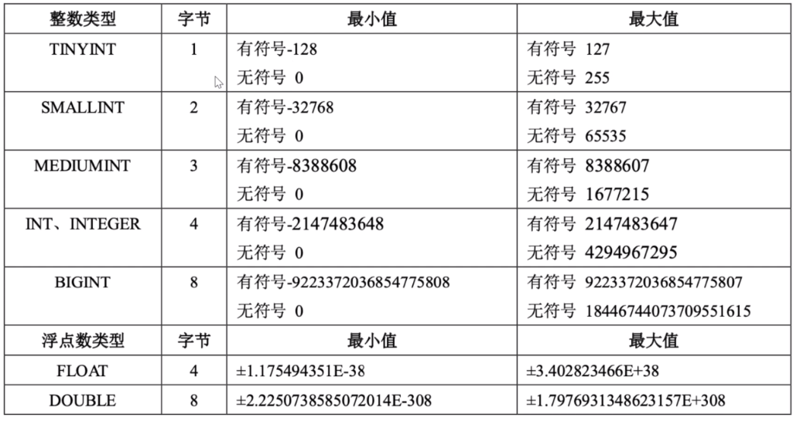
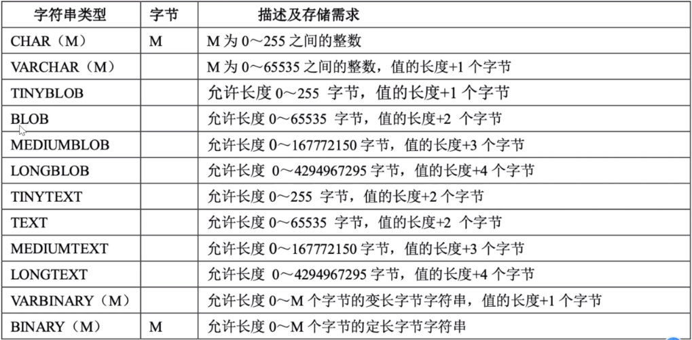
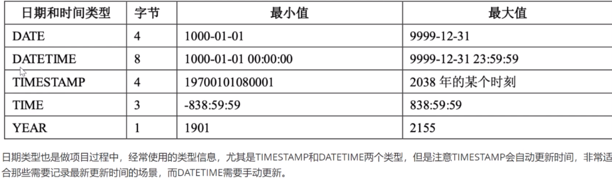

# MySQL介绍

MySQL目前属于Oracle，大家熟知的关系型数据库还有SQLServer、Oracle、MariaDB

关系型数据库：SQLLite  

NoSQL 非关系型数据库（key-value存储）---redis、leveldb、MongoDB

MySQL 区别于其他的关系型数据库的一个主要特点就是支持插件式的存储引擎，如innoDB、Memory等

MySQL的服务器模型采用的是IO复用+可伸缩的线程池  select+线程池（选用select的原因，因为数据库也涉及磁盘IO，不需要网络IO特别快，）

## mysql基本命令

#登陆mysql

**sudo mysql -uroot -p**
#切换数据库
use mysql;
#查询用户表命令：
select User,authentication_string,Host from user;

#检查服务状态

sudo service mysql status

#mysql服务启动停止

sudo service mysql  **stop/start**

## mysql数据类型

### 整数类型

### 字符串类型

超过字段的最大范围   就会出现截断

### 日期和时间类型

